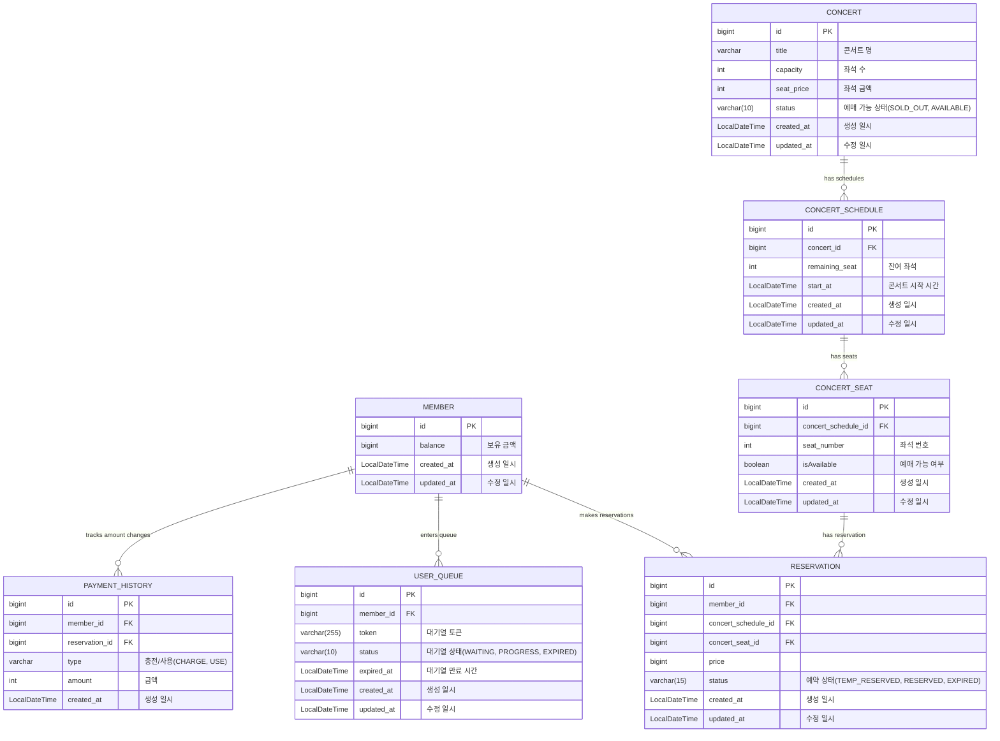

```mermaid
erDiagram
    MEMBER {
        bigint id PK
        bigint balance "보유 금액"
        LocalDateTime created_at "생성 일시"
        LocalDateTime updated_at "수정 일시"
    }

    USER_QUEUE {
        bigint id PK
        bigint member_id FK
        varchar(255) token "대기열 토큰"
        varchar(10) status "대기열 상태(WAITING, PROGRESS, EXPIRED)"
        LocalDateTime expired_at "대기열 만료 시간"
        LocalDateTime created_at "생성 일시"
        LocalDateTime updated_at "수정 일시"
    }

    CONCERT {
        bigint id PK
        varchar title "콘서트 명"
        int capacity "좌석 수"
        int seat_price "좌석 금액"
        varchar(10) status "예매 가능 상태(SOLD_OUT, AVAILABLE)"
        LocalDateTime created_at "생성 일시"
        LocalDateTime updated_at "수정 일시"
    }

    CONCERT_SCHEDULE {
        bigint id PK
        bigint concert_id FK
        int remaining_seat "잔여 좌석"
        LocalDateTime start_at "콘서트 시작 시간"
        LocalDateTime created_at "생성 일시"
        LocalDateTime updated_at "수정 일시"
    }

    CONCERT_SEAT {
        bigint id PK
        bigint concert_schedule_id FK
        int seat_number "좌석 번호"
        boolean isAvailable "예매 가능 여부"
        LocalDateTime created_at "생성 일시"
        LocalDateTime updated_at "수정 일시"
    }

    RESERVATION {
        bigint id PK
        bigint member_id FK
        bigint concert_schedule_id FK
        bigint concert_seat_id FK
        bigint price
        varchar(15) status "예약 상태(TEMP_RESERVED, RESERVED, EXPIRED)"
        LocalDateTime created_at "생성 일시"
        LocalDateTime updated_at "수정 일시"
    }

    PAYMENT_HISTORY {
        bigint id PK
        bigint member_id FK
        bigint reservation_id FK
        varchar type "충전/사용(CHARGE, USE)"
        int amount "금액"
        LocalDateTime created_at "생성 일시"
    }

    CONCERT ||--o{ CONCERT_SCHEDULE: "has schedules"
    CONCERT_SCHEDULE ||--o{ CONCERT_SEAT: "has seats"
    MEMBER ||--o{ RESERVATION: "makes reservations"
    MEMBER ||--o{ USER_QUEUE: "enters queue"
    CONCERT_SEAT ||--o{ RESERVATION: "has reservation"
    MEMBER ||--o{ PAYMENT_HISTORY: "tracks amount changes"

```