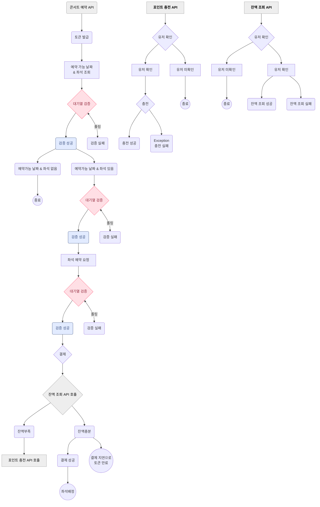

# FlowChart

```mermaid
flowchart TD
    reservation("콘서트 예약 API") --> token("토큰 발급")
    token --> concert_a["예약 가능 날짜 <p>&amp; 좌석 조회</p>"]
    concert_a --> token_vaild{"대기열 검증"}
    token_vaild --> token_vaild_ok("검증 성공")
    token_vaild_ok --> concert_no("예약가능 날짜 & 좌석 없음") & concert_ok("예약가능 날짜 & 좌석 있음")
    token_vaild <-- 폴링 --> token_vaild_no("검증 실패")
    concert_no --> concert_exit(("종료"))
    concert_ok --> token_vaild2{"대기열 검증"}
    token_vaild2 --> token_vaild_ok2("검증 성공")
    token_vaild2 <-- 폴링 --> token_vaild_no2("검증 실패")
    token_vaild_ok2 --> concert_seats["좌석 예약 요청"]
    concert_seats --> token_vaild3{"대기열 검증"}
    token_vaild3 --> token_vaild_ok3("검증 성공")
    token_vaild3 <-- 폴링 --> token_vaild_no3("검증 실패")
    token_vaild_ok3 --> concert_pay{"결제"}
    concert_pay --> getPoint{"잔액 조회 API 호출"}
    getPoint --> getPoint_ok("잔액충분") & getPoint_no("잔액부족")
    getPoint_no --> pointCharge["포인트 충전 API 호출"]
    getPoint_ok --> concert_pay_success("결제 성공") & concert_pay_expired(("결제 지연으로 <br> 토큰 만료"))
    concert_pay_success --> concert_apply(("좌석배정"))
%% 포인트 충전 API    
    pointCharge_user_check["<b>포인트 충전 API"] --> pointGet_user_check1{"유저 확인"}
    pointGet_user_check1 --> pointCharge_user_check_ok["유저 확인"] & pointCharge_user_check_no["유저 미확인"]
    pointCharge_user_check_ok --> chargPoint{"충전"}
    pointCharge_user_check_no --> pointCharge_exit(("종료"))
    chargPoint --> charge_ok("충전 성공") & charge_no("Exception <br>충전 실패")
%% 잔액 조회 API    
    pointGet["<b>잔액 조회 API"] --> pointGet_user_check{"유저 확인"}
    pointGet_user_check --> pointGet_user_check_ok["유저 확인"] & pointGet_user_check_no["유저 미확인"]
    pointGet_user_check_no --> pointGet_exit(("종료"))
    pointGet_user_check_ok --> get_ok("잔액 조회 성공") & get_no("잔액 조회 실패")
%%  CSS
    reservation:::Ash
    token_vaild:::Rose
    token_vaild_ok:::Sky
    token_vaild2:::Rose
    token_vaild_ok2:::Sky
    token_vaild3:::Rose
    token_vaild_ok3:::Sky
    getPoint:::Ash
    pointCharge:::Ash
    pointCharge_user_check:::Ash
    pointGet:::Ash
    classDef Rose stroke-width: 1px, stroke-dasharray: none, stroke: #FF5978, fill: #FFDFE5, color: #8E2236, stroke-width: 1px, stroke-dasharray: none, stroke: #FF5978, fill: #FFDFE5, color: #8E2236, stroke-width: 1px, stroke-dasharray: none, stroke: #FF5978, fill: #FFDFE5, color: #8E2236
    classDef Sky stroke-width: 1px, stroke-dasharray: none, stroke: #374D7C, fill: #E2EBFF, color: #374D7C, stroke-width: 1px, stroke-dasharray: none, stroke: #374D7C, fill: #E2EBFF, color: #374D7C, stroke-width: 1px, stroke-dasharray: none, stroke: #374D7C, fill: #E2EBFF, color: #374D7C
    classDef Ash stroke-width: 1px, stroke-dasharray: none, stroke: #999999, fill: #EEEEEE, color: #000000
```