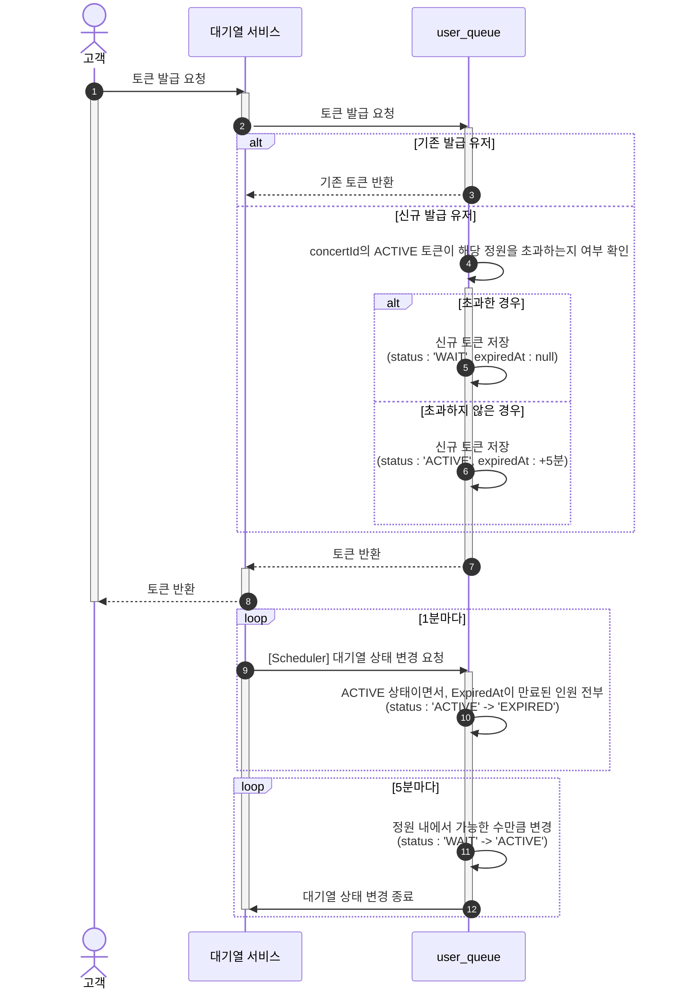
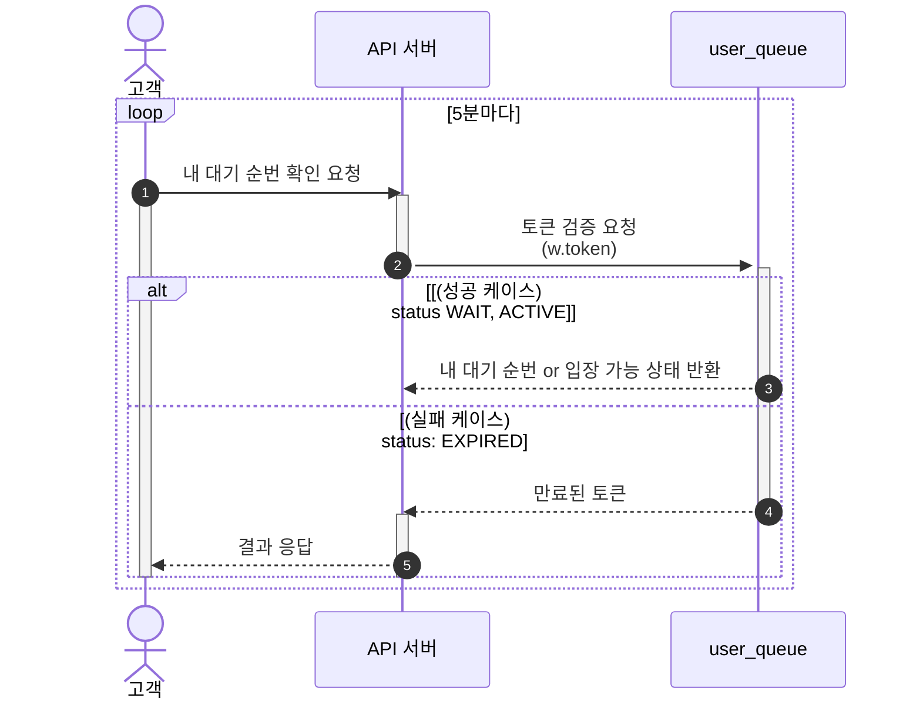
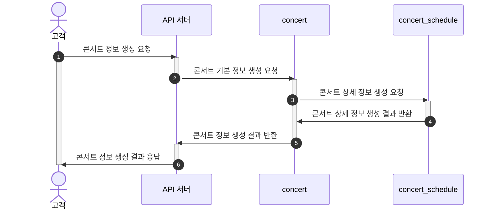
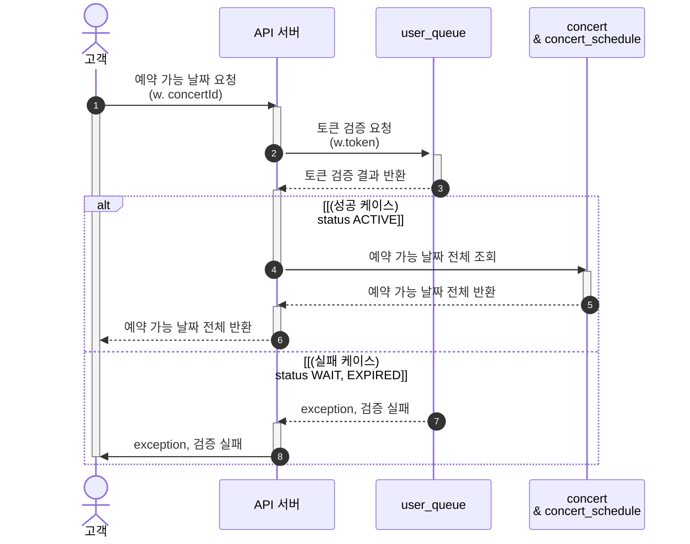
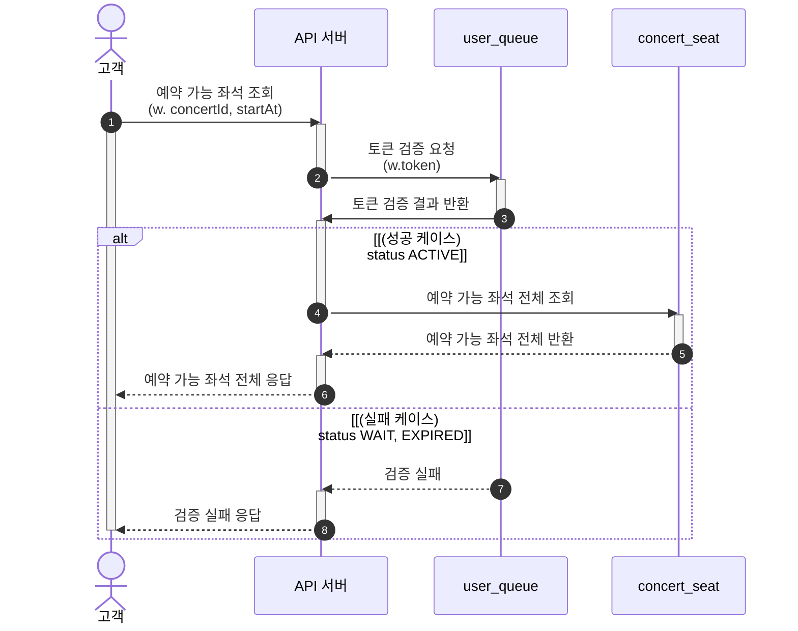
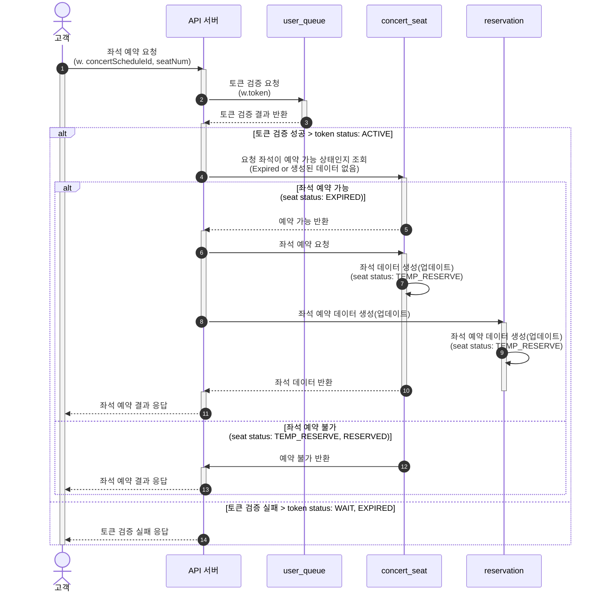
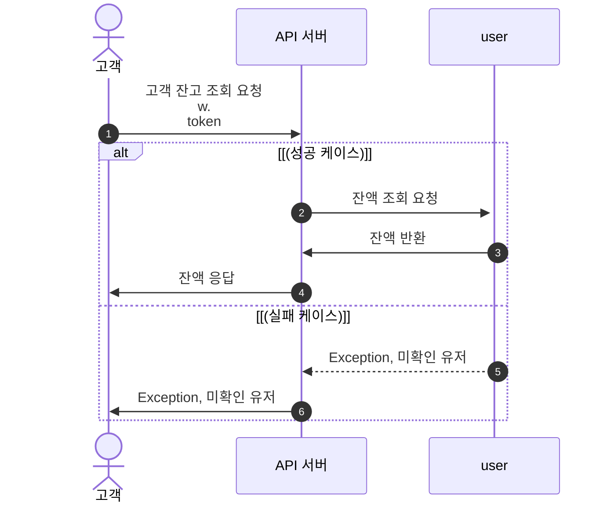
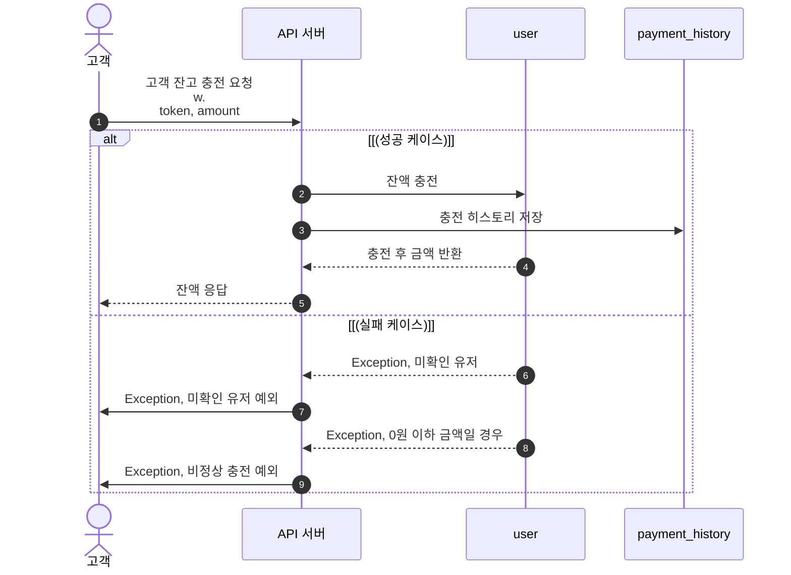
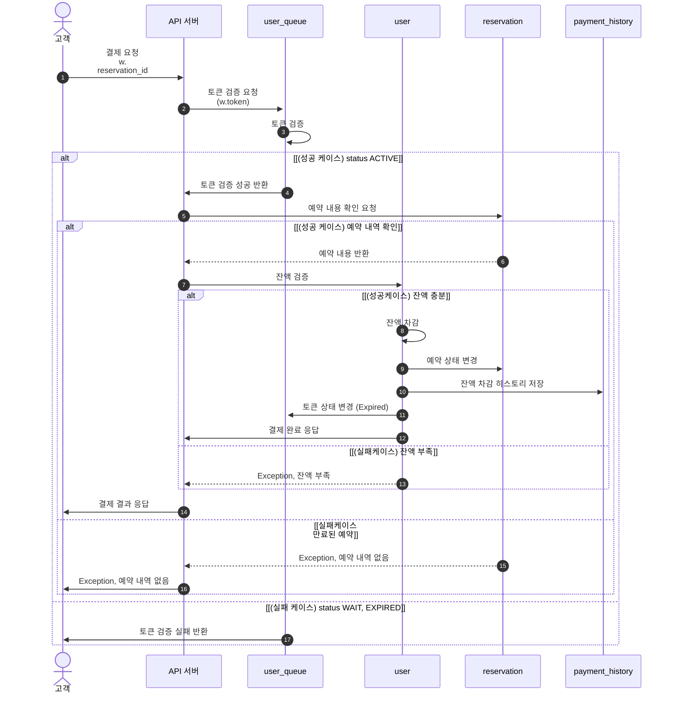

# API 목록
* 대기열
  * [토큰 발급 및 상태 변경](#토큰-발급-및-상태-변경)
  * [나의 대기번호 조회](#나의-대기번호-조회)
* 예약
  * [예약 가능 날짜 조회](#예약-가능-날짜-조회)
  * [예약 가능 좌석 조회](#예약-가능-좌석-조회)
  * [좌석 예약 요청](#좌석-예약-요청)
* 결제
  * [잔액 조회](#잔액-조회)
  * [잔액 충전](#잔액-충전)
  * [결제](#결제)
* 기타
  * [콘서트 정보 입력](#콘서트-정보-입력)

# 토큰 발급 및 상태 변경

# 나의 대기번호 조회

# 콘서트 정보 입력

# 예약 가능 날짜 조회

# 예약 가능 좌석 조회

# 좌석 예약 요청

# 잔액 조회

# 잔액 충전

# 결제

