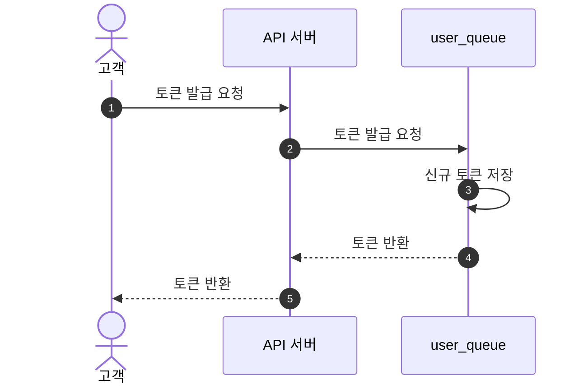
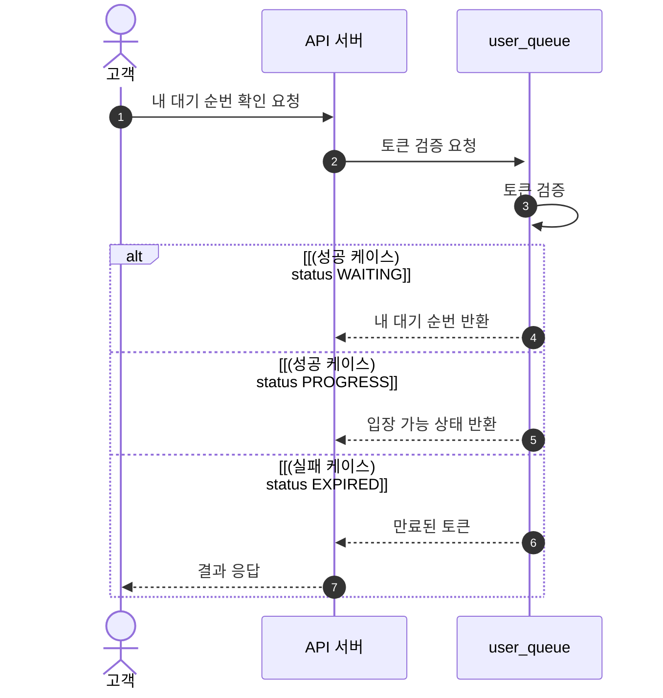
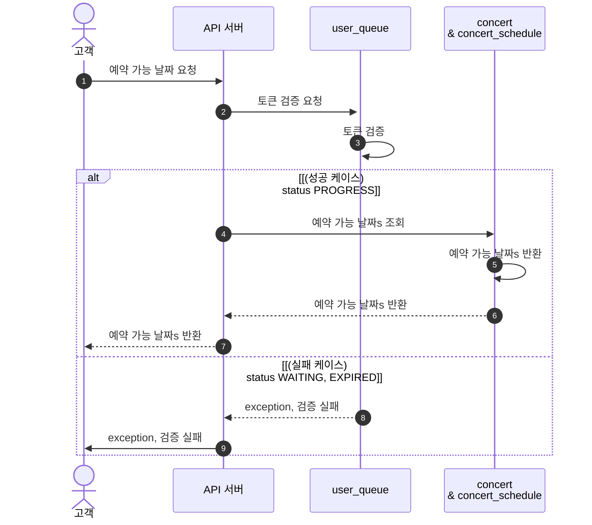
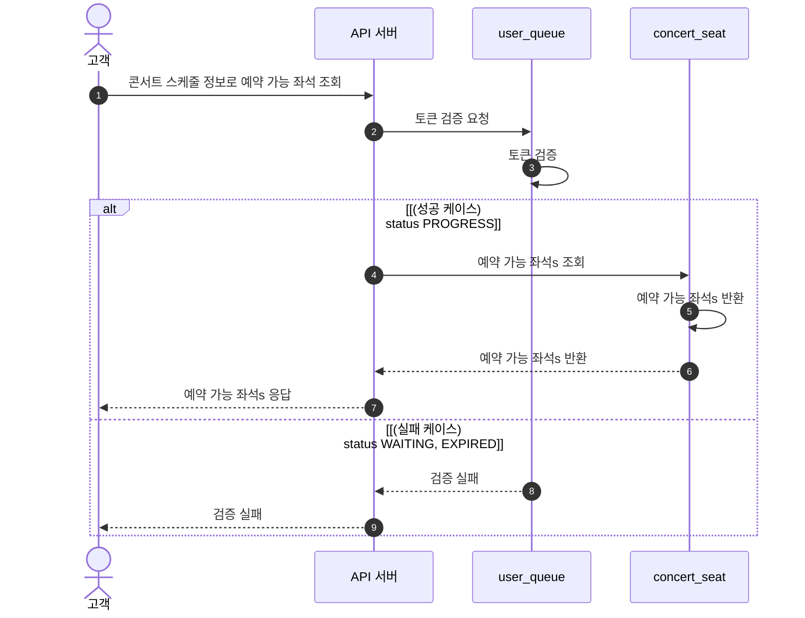
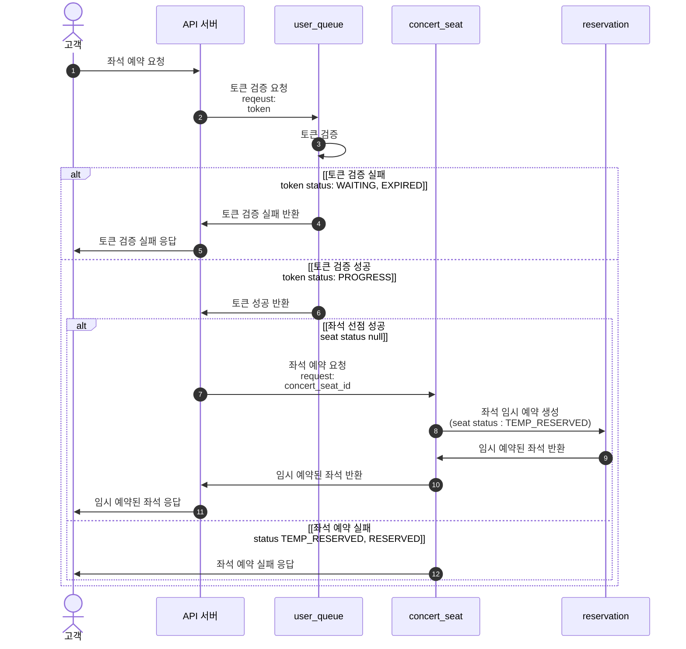
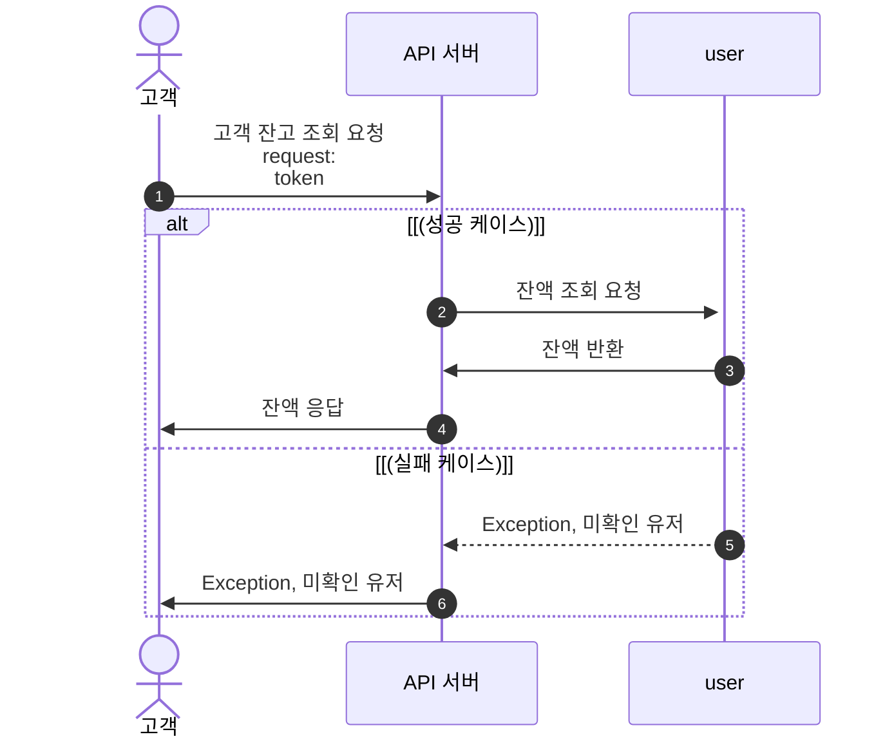
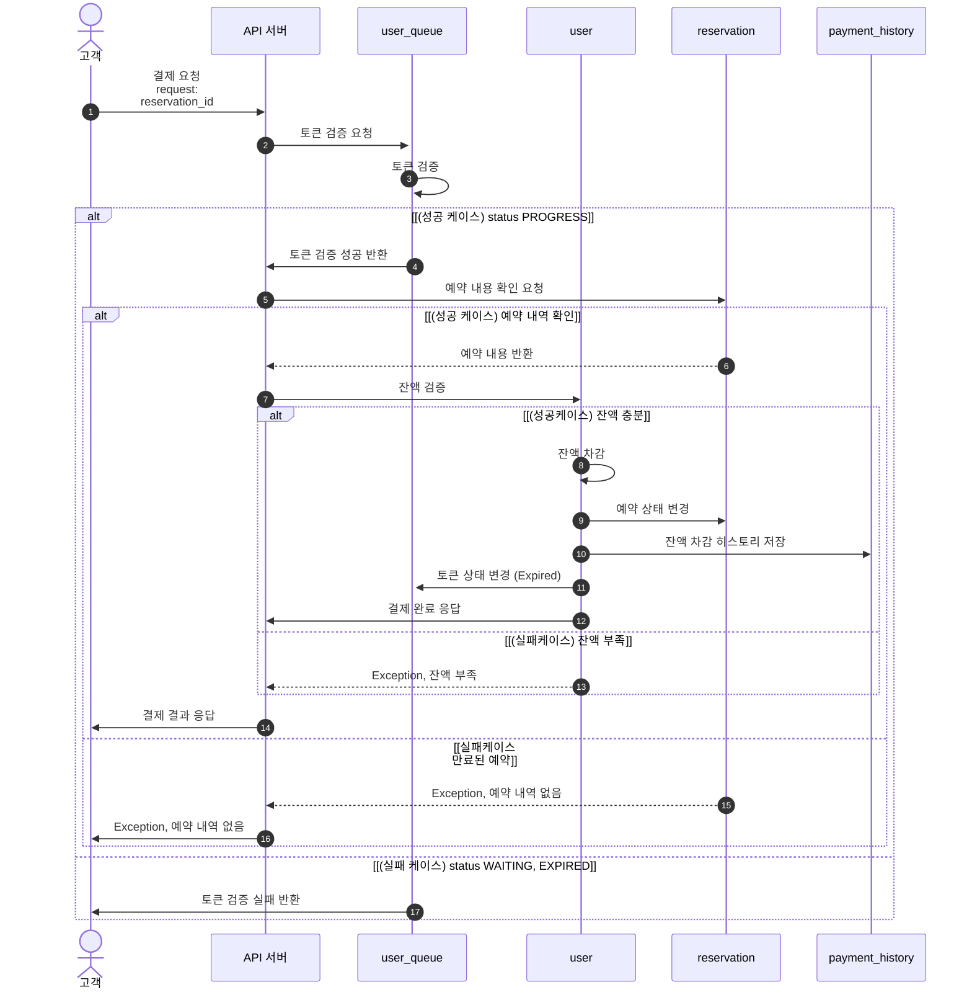

# 토큰 발급

```mermaid
sequenceDiagram
    autonumber
%%  선언부
    actor member as 고객
    participant api as API 서버
    participant queue as user_queue
%%  구현부
    member ->> api: 토큰 발급 요청
    api ->> queue: 토큰 발급 요청
    queue ->> queue: 신규 토큰 저장
    queue -->> api: 토큰 반환
    api -->> member: 토큰 반환
```

# 나의 대기번호 조회(polling)

```mermaid
sequenceDiagram
    autonumber
%%  선언부
    actor member as 고객
    participant api as API 서버
    participant queue as user_queue
%%  구현부
    member ->> api: 내 대기 순번 확인 요청
    api ->>+ queue: 토큰 검증 요청
    queue ->> queue: 토큰 검증

    alt [(성공 케이스)<br>status WAITING]
        queue -->> api: 내 대기 순번 반환
    else [(성공 케이스)<br>status PROGRESS]
        queue -->> api: 입장 가능 상태 반환 
    else [(실패 케이스)<br>status EXPIRED]
        queue -->> api: 만료된 토큰
        api -->> member: 결과 응답
    end
```

# 예약 가능 날짜 조회

```mermaid
sequenceDiagram
    autonumber
%%  선언부
    actor member as 고객
    participant api as API 서버
    participant queue as user_queue
    participant concert as concert <br>& concert_schedule
%%  구현부
    member ->> api: 예약 가능 날짜 요청
    api ->>+ queue: 토큰 검증 요청
    queue ->> queue: 토큰 검증

    alt [(성공 케이스)<br>status PROGRESS]
        api ->> concert: 예약 가능 날짜s 조회
        concert ->> concert: 예약 가능 날짜s 반환
        concert -->> api: 예약 가능 날짜s 반환
        api -->> member: 예약 가능 날짜s 반환
    else [(실패 케이스)<br>status WAITING, EXPIRED]
        queue -->> api: exception, 검증 실패
        api ->> member: exception, 검증 실패
    end

```

# 예약 가능 좌석 조회

```mermaid
sequenceDiagram
    autonumber
%%  선언부
    actor member as 고객
    participant api as API 서버
    participant queue as user_queue
    participant seat as concert_seat
%%  구현부
    member ->> api: 콘서트 스케줄 정보로 예약 가능 좌석 조회
    api ->> queue: 토큰 검증 요청
    queue ->> queue: 토큰 검증
    alt [(성공 케이스)<br>status PROGRESS]
        api ->> seat: 예약 가능 좌석s 조회
        seat ->> seat: 예약 가능 좌석s 반환
        seat -->> api: 예약 가능 좌석s 반환
        api -->> member: 예약 가능 좌석s 응답
    else [(실패 케이스)<br>status WAITING, EXPIRED]
        queue -->> api: 검증 실패
        api -->> member: 검증 실패
    end
```

# 좌석 예약 요청

```mermaid
sequenceDiagram
    autonumber
%%  선언부
    actor member as 고객
    participant api as API 서버
    participant queue as user_queue
    participant concert as concert_seat
    participant reservation as reservation
    member ->> api: 좌석 예약 요청
    api ->> queue: 토큰 검증 요청<br>reqeust:<br>token
    queue ->> queue: 토큰 검증

    alt [토큰 검증 실패<br> token status: WAITING, EXPIRED]
        queue ->> api: 토큰 검증 실패 반환
        api ->> member: 토큰 검증 실패 응답

    else [토큰 검증 성공<br> token status: PROGRESS]
        queue ->> api: 토큰 성공 반환
        alt [좌석 선점 성공<br>seat status null]
%%        좌석조회
            api ->> concert: 좌석 예약 요청<br>request:<br> concert_seat_id
            concert ->> reservation: 좌석 임시 예약 생성<br>(seat status : TEMP_RESERVED)
            reservation ->> concert: 임시 예약된 좌석 반환
            concert ->> api: 임시 예약된 좌석 반환
            api ->> member: 임시 예약된 좌석 응답
        else [좌석 예약 실패<br>status TEMP_RESERVED, RESERVED]
            concert ->> member: 좌석 예약 실패 응답
        end
    end
```

# 잔액 조회

```mermaid
sequenceDiagram
    autonumber
%%  선언부
    actor member as 고객
    participant api as API 서버
    participant user as user
%%  구현부
    member ->> api: 고객 잔고 조회 요청<br>request:<br>token

    alt [(성공 케이스)]
        api ->>+ user: 잔액 조회 요청
        user ->> api: 잔액 반환
        api ->> member: 잔액 응답
    else [(실패 케이스)]
        user -->> api: Exception, 미확인 유저
        api ->> member: Exception, 미확인 유저
    end
```

# 잔액 충전

```mermaid
sequenceDiagram
    autonumber
    autonumber
%%  선언부
    actor member as 고객
    participant api as API 서버
    participant user as user
    participant payment as payment_history
%%  구현부
    member ->> api: 고객 잔고 충전 요청<br>request:<br>token, amount

    alt [(성공 케이스)]
        api ->> user: 잔액 충전
        api ->> payment: 충전 히스토리 저장
        user -->> api: 충전 후 금액 반환
        api -->> member: 잔액 응답
    else [(실패 케이스)]
        user -->> api: Exception, 미확인 유저
        api ->> member: Exception, 미확인 유저 예외
        user -->> api: Exception, 0원 이하 금액일 경우
        api ->> member: Exception, 비정상 충전 예외
    end
```

# 결제

```mermaid
sequenceDiagram
    autonumber
%%  선언부
    actor member as 고객
    participant api as API 서버
    participant queue as user_queue
    participant user as user
%%    participant concert as concert<br> & concert_schedule<br> & concert_seat<br>
    participant reservation as reservation
    participant payment as payment_history
%%  구현부
    member ->> api: 결제 요청<br>request:<br>reservation_id
    api ->>+ queue: 토큰 검증 요청
    queue ->> queue: 토큰 검증

    alt [(성공 케이스) status PROGRESS]
        queue ->> api: 토큰 검증 성공 반환
        api ->> reservation: 예약 내용 확인 요청
        alt [(성공 케이스) 예약 내역 확인]
            reservation -->> api: 예약 내용 반환
            api ->> user: 잔액 검증
            alt [(성공케이스) 잔액 충분]
                user ->> user: 잔액 차감
                user ->> reservation: 예약 상태 변경
                user ->> payment: 잔액 차감 히스토리 저장
                user ->> queue: 토큰 상태 변경 (Expired)
                user ->> api: 결제 완료 응답
            else [(실패케이스) 잔액 부족]
                user -->> api: Exception, 잔액 부족
            end
            api ->> member: 결제 결과 응답
        else [실패케이스<br>만료된 예약]
            reservation -->> api: Exception, 예약 내역 없음
            api ->> member: Exception, 예약 내역 없음
        end
    else [(실패 케이스) status WAITING, EXPIRED]
        queue ->> member: 토큰 검증 실패 반환
    end
```